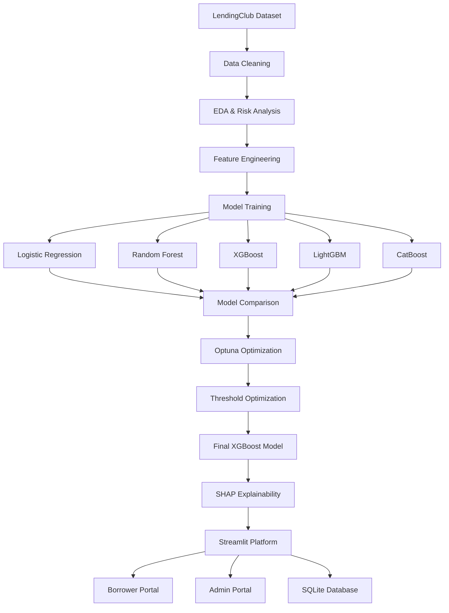

# 💳 Lending Risk Platform

## Executive Summary

Lending Risk Platform is an end-to-end Explainable AI underwriting system built on historical LendingClub loan data. The platform predicts Probability of Default (PD), applies business-driven lending decisions, provides SHAP-based explanations, and supports both borrower and underwriter workflows.

### Key Highlights

- XGBoost-based lending risk model
- Explainable AI using SHAP
- Optuna hyperparameter optimization
- Threshold optimization using F-beta (β=2)
- Borrower recommendation engine
- Underwriter review workflow
- Streamlit deployment
- SQLite persistence layer

---

# Business Problem

Traditional lending systems face two major risks:

1. Approving borrowers who later default.
2. Rejecting borrowers who could have repaid successfully.

The objective is not simply maximizing accuracy.

The business goal is:

- Detect risky borrowers early
- Minimize costly missed defaults
- Maintain transparency
- Support human underwriters
- Provide actionable borrower guidance

---

# System Architecture



---

# End-to-End Workflow

```text
Historical LendingClub Data
            ↓
Data Cleaning
            ↓
Exploratory Data Analysis
            ↓
Feature Engineering
            ↓
Train/Test Split
            ↓
Class Imbalance Handling
            ↓
Model Training
            ↓
Model Comparison
            ↓
Optuna Hyperparameter Optimization
            ↓
Threshold Optimization
            ↓
Final XGBoost Selection
            ↓
SHAP Explainability
            ↓
Decision Engine
            ↓
Streamlit Deployment
```

---

# Dataset

Source: LendingClub Historical Loan Dataset

Approximate Portfolio Statistics:

- Fully Paid: 80.3%
- Charged Off / Default: 19.7%
- Class Imbalance: ~4:1

Target Variable:

| Loan Status | Target |
|------------|---------|
| Fully Paid | 0 |
| Charged Off / Default | 1 |

---

# Data Cleaning

Performed in `src/data_loader.py`

### Cleaning Steps

- Retained only relevant underwriting columns
- Filtered ambiguous loan statuses
- Converted percentages to numeric values
- Converted loan term strings into integers
- Standardized employment length
- Outlier treatment using annual income capping (99th percentile)

Examples:

- "36 months" → 36
- "13.56%" → 13.56
- "10+ years" → 10

---

# Feature Engineering

Implemented in `src/feature_engineering.py`

### Core Features

- loan_amnt
- term
- int_rate
- installment

### Income & Debt Features

- log_annual_inc
- dti
- emi_to_income
- revol_bal_to_income
- loan_to_income

### Credit Behaviour Features

- open_acc
- total_acc
- mort_acc
- pub_rec_bankruptcies
- credit_history_years
- acc_open_per_year

### Interaction Features

- dti_x_grade
- util_x_loan_to_income

### Encoded Features

- grade_encoded
- purpose_encoded
- home_ownership_encoded

### Risk Signals

- is_high_risk_purpose

---

# Why These Features Matter

### Loan-to-Income Ratio

Measures exposure relative to repayment capacity.

### EMI-to-Income Ratio

Measures affordability burden.

### Credit History Years

Captures borrower credit maturity.

### Account Opening Velocity

Detects aggressive credit-seeking behaviour.

### DTI × Grade

Captures compounded risk from poor credit quality and debt burden.

### Utilization × Loan-to-Income

Captures combined financial stress.

---

# Exploratory Data Analysis

The EDA dashboard contains:

### Loan Status Distribution

- Default rate analysis
- Class imbalance analysis

### Grade vs Default

| Grade | Default Rate |
|---------|---------|
| A | 6.5% |
| B | 12.7% |
| C | 21.7% |
| D | 28.3% |
| E | 36.7% |
| F | 42.0% |
| G | 48.7% |

### DTI Analysis

Investigates borrower debt burden.

### Utilization Analysis

Studies revolving credit utilization behaviour.

### Correlation Analysis

Examines relationships between engineered features.

---

# Class Imbalance Strategy

Defaults represent the minority class.

Instead of SMOTE, the project uses:

`scale_pos_weight`

Reason:

- Preserves real borrower distribution
- Works effectively with tree-based models
- Avoids synthetic borrower generation

---

# Models Evaluated

| Model | ROC-AUC | Recall | F-Beta |
|---------|---------|---------|---------|
| Logistic Regression | 0.7066 | 0.6355 | 0.5299 |
| Random Forest | 0.7135 | 0.6014 | 0.5181 |
| XGBoost | 0.7208 | 0.6828 | 0.5533 |
| LightGBM | 0.7206 | 0.6606 | 0.5453 |
| CatBoost | 0.7172 | 0.6684 | 0.5471 |

---

# Why XGBoost Won

XGBoost achieved the strongest overall balance between:

- ROC-AUC
- Recall
- F-Beta

It captured nonlinear relationships between:

- Debt burden
- Credit quality
- Utilization
- Borrower exposure

better than competing models.

---

# Hyperparameter Optimization

Optuna was used for automated tuning.

Optimization Objective:

### F-Beta (β=2)

Why?

In lending, missing a future defaulter is more expensive than reviewing additional applications.

Therefore recall was weighted more heavily than precision.

---

# Threshold Optimization

Default classification threshold:

```text
0.50
```

Production threshold:

```text
0.13
```

Reason:

Threshold optimization using F-Beta maximization significantly improved recall and reduced missed defaults.

### Final Business Rules

| PD Range | Decision |
|----------|----------|
| PD < 0.13 | APPROVE |
| 0.13 ≤ PD ≤ 0.60 | REVIEW |
| PD > 0.60 | REJECT |

---

# Explainable AI

SHAP is used to explain predictions.

Top Risk Drivers:

1. Credit Grade
2. Debt Burden × Credit Grade
3. Loan Term
4. Interest Rate
5. Home Ownership
6. Loan-to-Income Ratio

Benefits:

- Transparency
- Trust
- Regulatory friendliness
- Underwriter support

---

# Borrower Portal

### Dashboard

- Profile overview
- Latest application
- Risk summary

### Loan Application

- Real-time PD prediction
- Approval workflow

### Improve Approval Chances

Implemented using a scenario optimization engine.

Generates:

- Loan reduction scenarios
- Utilization reduction plans
- Debt reduction plans
- Credit profile simulations

### Application History

- Historical applications
- Decisions
- Risk metrics

---

# Admin Portal

## Applications

- Underwriting review queue
- Override decisions
- Manual approval workflow

## Risk Monitoring

- Model metrics
- Threshold analysis
- Confusion matrix
- Model comparison
- SHAP monitoring

## Risk Insights

- Loan status analysis
- Grade risk analysis
- DTI analysis
- Utilization analysis
- Correlation analysis

---

# Technology Stack

## Frontend

- Streamlit

## Machine Learning

- Scikit-Learn
- XGBoost
- LightGBM
- CatBoost
- Optuna
- SHAP

## Data Processing

- Pandas
- NumPy

## Visualization

- Plotly

## Database

- SQLite

---

# Project Structure

```text
lending-risk-platform/
│
├── app/
│   ├── pages/
│   │   ├── dashboard.py
│   │   ├── loan_check.py
│   │   ├── improve.py
│   │   ├── history.py
│   │   ├── review_queue.py
│   │   ├── model_dashboard.py
│   │   └── eda_analytics.py
│   │
│   ├── auth.py
│   ├── ui.py
│   └── main.py
│
├── src/
│   ├── data_loader.py
│   ├── feature_engineering.py
│   ├── predictor.py
│   ├── whatif_engine.py
│   ├── train.py
│   ├── evaluate.py
│   └── config.py
│
├── database/
│
├── models/
│
├── notebooks/
│
└── README.md
```

---

# Results

| Metric | Value |
|----------|----------|
| Best Model | XGBoost |
| ROC-AUC | 0.7204 |
| Recall | 0.8349 |
| Threshold | 0.13 |

---

# Future Improvements

- Drift Monitoring
- Reject Inference
- Cost-Based Learning
- Champion-Challenger Models
- Real-Time Retraining
- Bureau Data Integration

---

# Author

**Krishna Sinha**  
NeoSoft Data Science Intern

Built as an end-to-end Explainable AI underwriting platform demonstrating machine learning engineering, lending risk analytics, threshold optimization, and decision-support systems.
